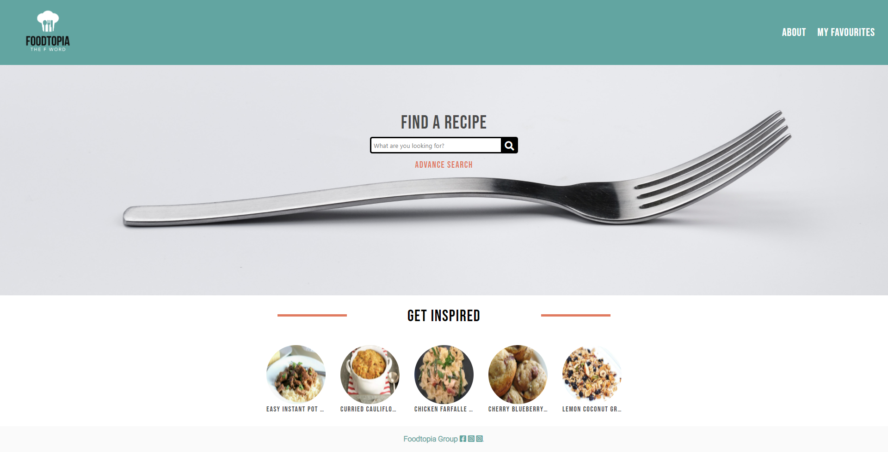
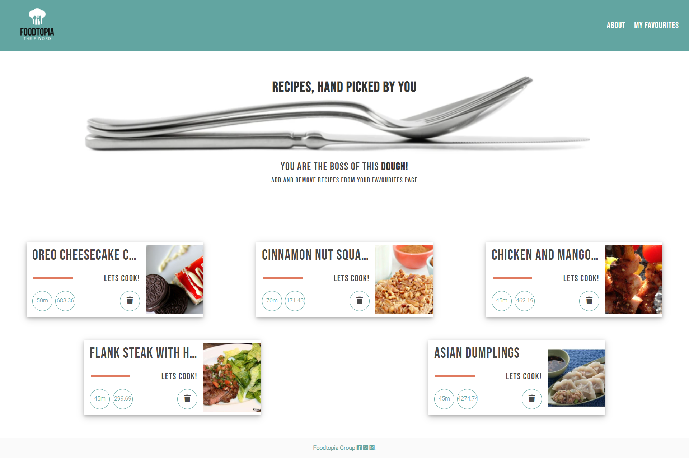
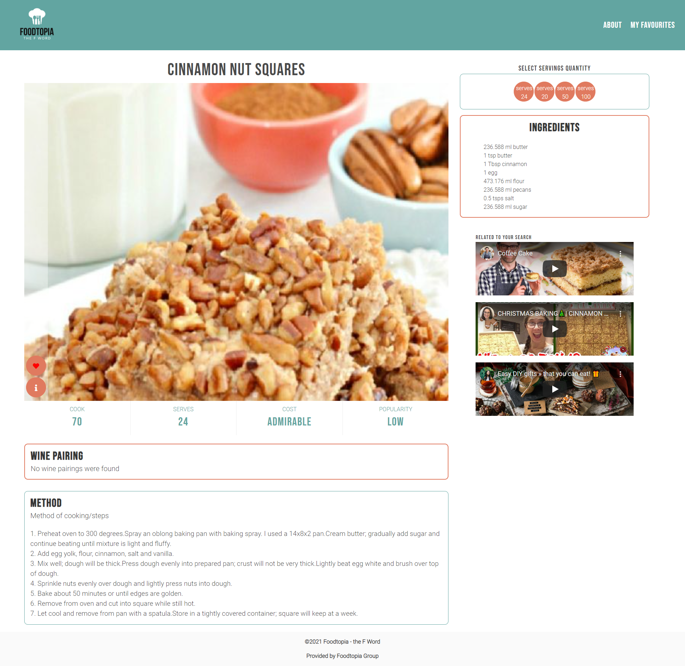

<h1>Foodtopia</h1>

You can view the GitHub pages deployed application [here](https://fudge88.github.io/foodtopia/).

<h2>Table of Contents</h2>

- [Description](#description)
- [User Story](#user-story)
- [Technologies Used](#technologies-used)
- [API Documentation](#api-documentation)
- [Contributors](#contributors)
- [Improvements](#improvements)
- [Screenshots](#screenshots)
  - [Wireframes](#wireframes)
  - [Final Website](#final-website)
  - [References](#References)

## Description

Foodtopia is a recipe app, which assists users with advanced dietary needs. This app also provides an advanced mathematical calculator to present quantity of ingredients for catering services and to cater for larger parties.

A responsive dynamic app which will run in the browser. Foodtopia is easy to use application and user led database search engine for different types of recipes. The website requires direct input from the user, in order to display results relating to their specific search. The user is able to filter their search using dietary options, types of cuisines and intolerances.

## User Story

```
AS a user I expect to FIND a main page with a navigation bar on the top containing the brand LOGO and links to navigate to other pages.

I would ALSO expect an easy to use search bar, with an advanced filter button. Diet,

WHEN i click on the advanced search button i EXPECT to find checkboxes to help filter my recipes.

as I SCROLL to the bottom of the index page, i WOULD like to have random recipes displayed for 'inspiration'. IF i click on this recipe, i EXPECT to be taken to this recipe.

When I SEARCH a recipe.

I should be REDIRECTED to the menus page, Where I expect to SEE recipe cards related to my search.

IF i missed the option to filter on the index, i WOULD like to have the option on the recipes incase i change my mind.

I WOULD like my first glance at the recipes to give me:

- a image of the dish
- the recipe title
- the time and the calories for

i WOULD also like the option to QUICK save the recipes without having to relocate to a different page, so i can ADD MULTIPLE recipes in one go.

When I CLICK on the 'LETS COOK' on card recipe

I EXPECT to be relocated to that specific recipe page

I WOULD like to see:

- the recipe name,
- the image of the recipe
- a box with the instructions for the recipe
- a box with the methods of how to cook the recipe
- a box with the wine pairing for the recipe
- to ability to see the time, portions, costs and popularity
- one option button (to add to Favorites)
- one option button (to view nutritional value)
- YouTube video links to see the recipe
- calculator to multiply the ingredients depending on servings

When I CLICK on the 'HEART' the recipe SHOULD be saved to 'my favourites'.


When I CLICK on My Favourites link

I EXPECT to be relocated to a page presenting all my SAVED recipe cards

```

## Technologies Used

#### Languages

- HTML5
- CSS
- JavaScript
- JQuery

#### Frameworks used

- Bulma CSS Framework
- Font Awesome
- Google Fonts CDN

#### APIs

- Spoonacular API
- Youtube API

## API Documentation

[Spoonacular](https://spoonacular.com/food-api) and [YouTube](https://developers.google.com/youtube/v3/getting-started?hl=en) APIs

- Spoonacular is one of the first food management system that combines dining out, eating store-bought food, and cooking at home to help you find and organize the restaurants, products, and recipes that fit your diet and can help you reach your nutrition goals.

- YouTube Data API, you can add a variety of YouTube features to your application. Use the API to upload videos, manage playlists and subscriptions, update channel settings, and more.

## Contributors

- Anab: [https://github.com/anabwarsame](https://github.com/anabwarsame)
- Fahra: [https://github.com/fudge88](https://github.com/fudge88)
- Leanne: [https://github.com/lenny-g](https://github.com/lenny-g)
- Liana: [https://github.com/lianavaleria15](https://github.com/lianavaleria15)
- Luiz: [https://github.com/luizfroes](https://github.com/luizfroes)

## Improvements

- Modal to confirm deletion
- Ability to create a menu planner
- Offer a feedback option
- Present more information on cards
- Save videos to local storage

## Screenshots

### Wireframes

#### INDEX PAGE Large and small screen Wireframe


#### MENU PAGE Large and small screen Wireframe


#### FAVOURITES PAGE Large and small screen Wireframe


#### Large and small screen Wireframe


### Final Website

#### INDEX PAGE screenshot



#### MENU PAGE screenshot


#### FAVOURITES PAGE screenshot



#### RECIPES screenshot



## References

[Background Image by Samuel Berner](https://unsplash.com/@saaam_chan?utm_source=unsplash&utm_medium=referral&utm_content=creditCopyText)

[Flexbox positioning](https://developer.mozilla.org/en-US/docs/Web/CSS/CSS_Flexible_Box_Layout/Aligning_Items_in_a_Flex_Container)

[Webm to Gif converter](https://cloudconvert.com/webm-to-gif)

[Screencastify - screen recording](https://www.screencastify.com/)

[Mozilla.org](https://developer.mozilla.org/en-US/docs/Web/JavaScript/Reference/Global_Objects/Array/forEach)

[StackOverflow](https://stackoverflow.com/questions/9329446/for-each-over-an-array-in-javascript)

[Spoonacular](https://spoonacular.com/food-api)

[YouTube](https://developers.google.com/youtube/v3/getting-started?hl=en)  

## License

This project is licensed under the terms of the MIT license.

